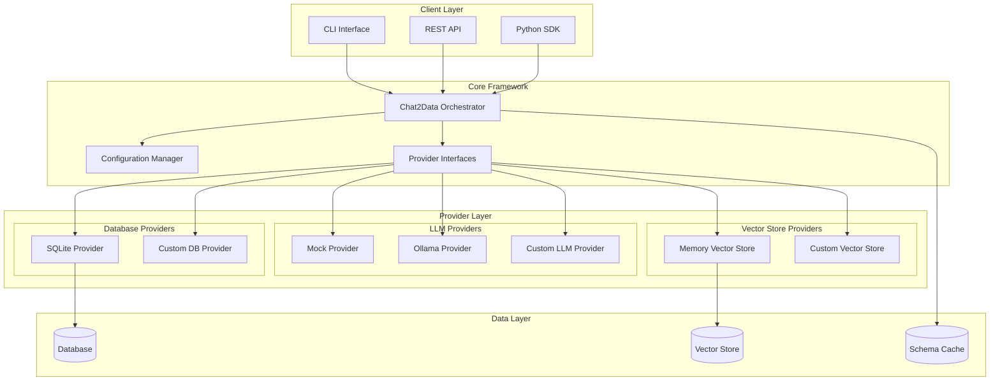
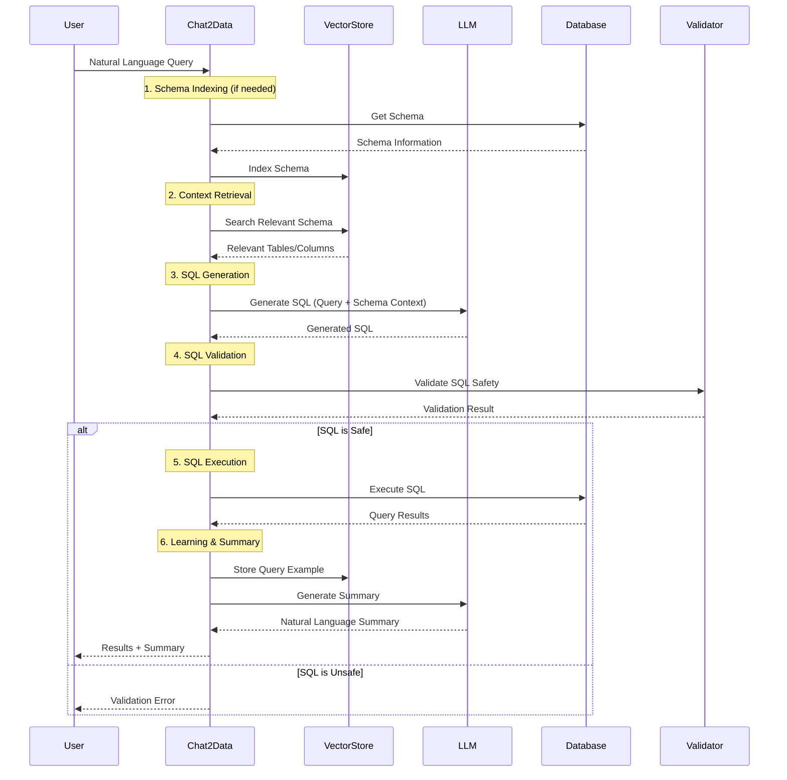
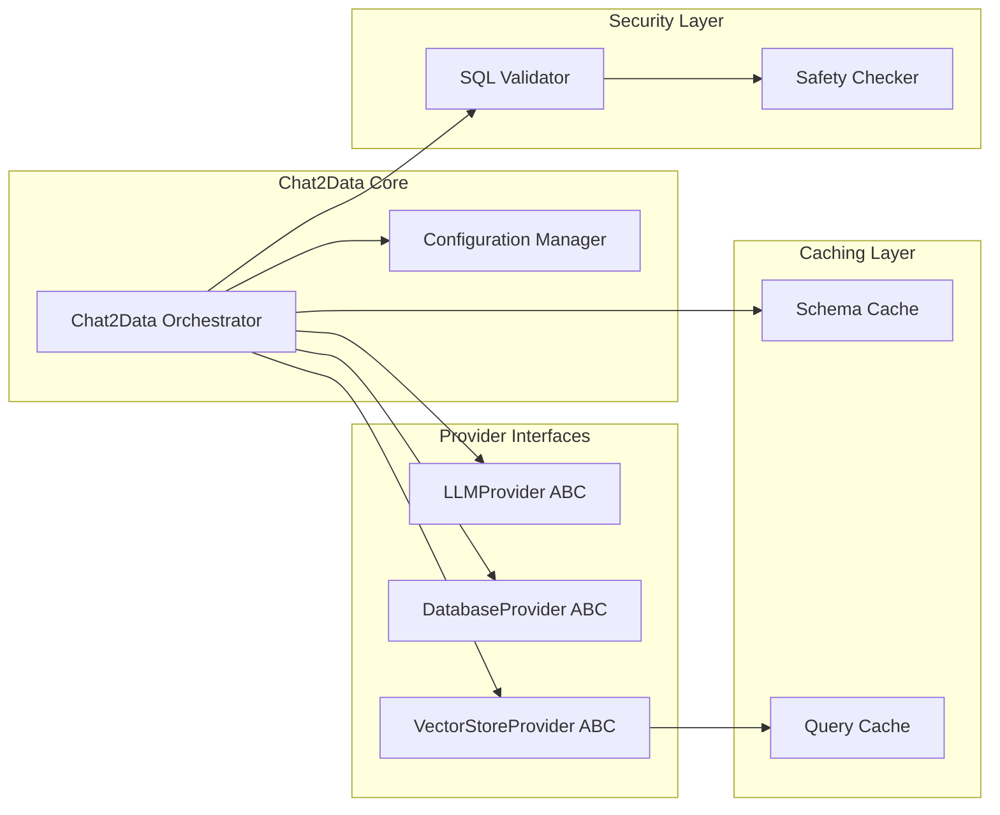
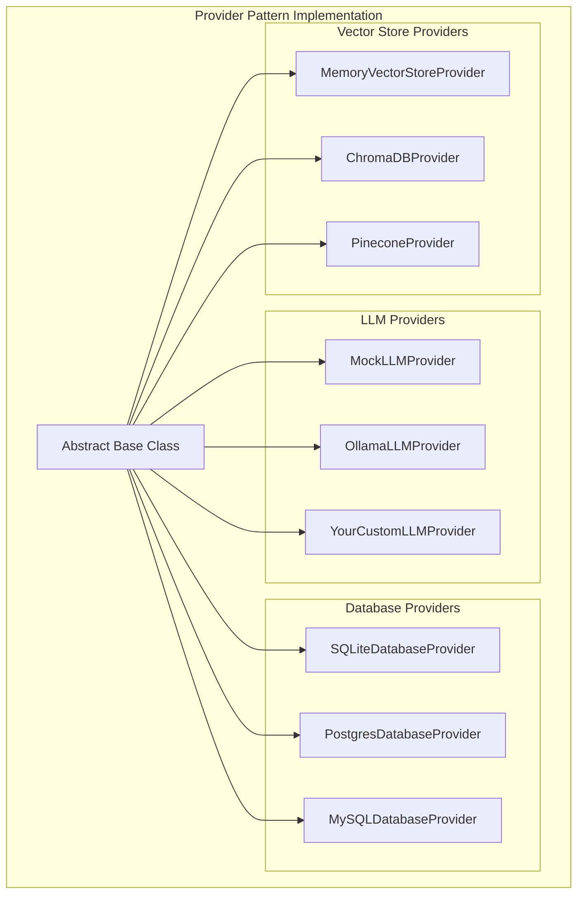

# Chat2Data Framework Architecture

## Overview

Chat2Data is a modular framework for converting natural language queries into SQL using Large Language Models (LLMs). The framework follows a provider-based architecture that enables flexible integration of different LLM services, databases, and vector stores.

**Last Updated:** 2025-01-20
**Framework Version:** 0.1.0

## System Architecture

### High-Level Architecture Diagram



### Data Flow Diagram



### Component Interaction Diagram



### Provider Architecture Pattern



## Core Components

### 1. Chat2Data Orchestrator (`chat2data/core/chat2data.py`)

**Responsibilities:**
- Coordinate all provider interactions
- Manage query lifecycle from natural language to results
- Handle error recovery and fallback mechanisms
- Maintain schema indexing state
- Orchestrate security validations

**Key Methods:**
- `query(natural_language_query)` - Main query processing pipeline
- `health_check()` - System health monitoring
- `get_schema()` - Database schema retrieval
- `get_similar_queries()` - Query history search

**Interaction Patterns:**
- Dependency injection of providers during initialization
- Async/await for non-blocking operations
- Centralized error handling with structured responses

### 2. Provider Base Classes (`chat2data/core/base.py`)

**LLMProvider Interface:**
```python
@abstractmethod
async def generate_sql(self, query: str, schema_context: List[Dict[str, Any]]) -> str
async def generate_summary(self, data: List[Dict[str, Any]], query: str) -> str
def is_available(self) -> bool
```

**DatabaseProvider Interface:**
```python
@abstractmethod
def execute_query(self, sql: str) -> QueryResult
def get_schema(self) -> List[SchemaInfo]
def validate_sql(self, sql: str) -> Tuple[bool, str]
def is_connected(self) -> bool
```

**VectorStoreProvider Interface:**
```python
@abstractmethod
def search_relevant_schema(self, query: str, k: int = 5) -> List[Dict[str, Any]]
def index_schema(self, schema: List[SchemaInfo]) -> bool
def store_query_example(self, query: str, sql: str) -> bool
def get_similar_queries(self, query: str, k: int = 5) -> List[str]
```

### 3. Configuration Manager (`chat2data/config/settings.py`)

**Features:**
- Multi-source configuration (environment, files, auto-detection)
- Provider auto-discovery and fallback mechanisms
- Validation and type safety using Pydantic
- Runtime configuration updates

**Configuration Sources (Priority Order):**
1. Environment variables (`CHAT2DATA_*`)
2. Configuration files (`chat2data.json`, `.chat2data.yml`)
3. Default values with auto-detection

### 4. Database Provider (`chat2data/providers/database/sqlite_provider.py`)

**Capabilities:**
- Automatic sample database creation
- Schema introspection and metadata extraction
- Row-level security with dict-based results
- Connection health monitoring

**Sample Database Schema:**
- `categories` - Product categories
- `products` - Product catalog with pricing
- `customers` - Customer information
- `orders` - Order management
- `order_items` - Order line items

### 5. LLM Providers

**Mock Provider (`mock_provider.py`):**
- Zero external dependencies
- Rule-based SQL generation for testing
- Deterministic responses for development

**Ollama Provider (`ollama_provider.py`):**
- Local LLM integration via PydanticAI
- Configurable model selection
- Context-aware prompt engineering
- Automatic response parsing and validation

### 6. Vector Store Provider (`chat2data/providers/vector/memory_provider.py`)

**Features:**
- Keyword-based schema relevance scoring
- Query example storage and retrieval
- Simple similarity matching for query history
- In-memory operation with no external dependencies

## Design Patterns Used

### 1. Provider Pattern

**Implementation:**
- Abstract base classes define contracts
- Concrete providers implement specific technologies
- Runtime provider swapping through dependency injection
- Consistent interface across different backend services

**Benefits:**
- Technology independence
- Easy testing with mock providers
- Gradual migration between services
- Plugin-style extensibility

### 2. Async/Await Pattern

**Usage:**
```python
async def query(self, natural_language_query: str) -> Dict[str, Any]:
    # Async operations for LLM calls
    sql = await self.llm.generate_sql(query, schema_context)
    summary = await self.llm.generate_summary(data, query)
```

**Benefits:**
- Non-blocking I/O for external API calls
- Better resource utilization
- Scalable for concurrent requests

### 3. Dependency Injection

**Pattern:**
```python
def __init__(self, llm_provider: LLMProvider, database_provider: DatabaseProvider, ...):
    self.llm = llm_provider
    self.database = database_provider
```

**Benefits:**
- Loose coupling between components
- Easy unit testing with mock dependencies
- Runtime configuration flexibility

### 4. Factory Pattern for Providers

**Configuration-driven instantiation:**
```python
config = Config.auto_detect()
llm_provider = create_llm_provider(config.llm)
db_provider = create_database_provider(config.database)
```

## Important Technical Details

### SQL Injection Prevention

**Multi-layer Security:**

1. **SQL Validation (`validate_sql` method):**
   ```python
   dangerous_keywords = ['DROP', 'DELETE', 'INSERT', 'UPDATE', 'ALTER', ...]
   dangerous_patterns = ['UNION', ';']  # Prevent query chaining
   ```

2. **Query Type Restrictions:**
   - Only `SELECT` statements allowed
   - No DDL or DML operations permitted
   - Syntax validation for balanced parentheses

3. **Parameterized Query Support:**
   - SQLite row factory for safe column access
   - No string concatenation in SQL generation

### Schema Caching Strategy

**Lazy Loading:**
```python
if not self._schema_indexed:
    await self._ensure_schema_indexed()
```

**Benefits:**
- Automatic schema discovery on first use
- Efficient memory usage
- Force refresh capability for schema changes

**Cache Invalidation:**
- Manual refresh via `force_reindex_schema()`
- No automatic TTL (assumes schema stability)

### Error Handling Approach

**Structured Error Responses:**
```python
{
    "success": False,
    "query": "original query",
    "sql": "attempted sql",
    "error": "detailed error message"
}
```

**Error Recovery:**
- Graceful degradation with fallback responses
- Comprehensive logging for debugging
- Provider-specific error handling

**Exception Hierarchy:**
- Framework exceptions bubble up through orchestrator
- Provider exceptions are caught and transformed
- Network timeouts and service unavailability handled

### Configuration Management

**Auto-Detection Strategy:**
```python
@classmethod
def auto_detect(cls) -> "Config":
    # 1. Load from environment variables
    # 2. Search for config files
    # 3. Auto-detect available services (Ollama, etc.)
    # 4. Apply sensible defaults
```

**Provider Availability Checking:**
- Ollama: HTTP health check to `/api/tags`
- Database: Connection test with simple query
- Vector Store: Instantiation check

## Extension Points

### Adding New LLM Providers

**Step 1: Implement the Interface**
```python
from chat2data.core.base import LLMProvider

class YourLLMProvider(LLMProvider):
    async def generate_sql(self, query: str, schema_context: List[Dict[str, Any]]) -> str:
        # Your implementation
        pass

    async def generate_summary(self, data: List[Dict[str, Any]], query: str) -> str:
        # Your implementation
        pass

    def is_available(self) -> bool:
        # Check service availability
        pass

    @property
    def name(self) -> str:
        return "Your LLM Provider"
```

**Step 2: Register in Configuration**
```python
# In your provider's __init__.py
from .your_provider import YourLLMProvider

__all__ = ["YourLLMProvider"]
```

**Step 3: Update Configuration Schema**
```python
# Add to config/settings.py
class LLMConfig(BaseModel):
    provider: str = Field(default="your_provider", description="LLM provider")
    # Add your provider-specific config fields
```

### Adding New Database Providers

**Example: PostgreSQL Provider**
```python
from chat2data.core.base import DatabaseProvider, QueryResult, SchemaInfo

class PostgreSQLProvider(DatabaseProvider):
    def __init__(self, connection_string: str):
        self.connection_string = connection_string
        # Initialize psycopg2 or asyncpg connection

    def execute_query(self, sql: str) -> QueryResult:
        # Execute using PostgreSQL driver
        pass

    def get_schema(self) -> List[SchemaInfo]:
        # Query information_schema tables
        pass

    def validate_sql(self, sql: str) -> Tuple[bool, str]:
        # PostgreSQL-specific validation
        pass
```

**Integration Requirements:**
- Implement all abstract methods from `DatabaseProvider`
- Handle database-specific data types
- Provide schema introspection for your database
- Implement connection pooling if needed

### Adding New Vector Store Providers

**Example: ChromaDB Provider**
```python
from chat2data.core.base import VectorStoreProvider, SchemaInfo

class ChromaDBProvider(VectorStoreProvider):
    def __init__(self, collection_name: str = "chat2data_schema"):
        import chromadb
        self.client = chromadb.Client()
        self.collection = self.client.create_collection(collection_name)

    def search_relevant_schema(self, query: str, k: int = 5) -> List[Dict[str, Any]]:
        # Use ChromaDB similarity search
        results = self.collection.query(query_texts=[query], n_results=k)
        return self._format_results(results)

    def index_schema(self, schema: List[SchemaInfo]) -> bool:
        # Convert schema to embeddings and store
        pass
```

**Requirements:**
- Handle vector embeddings for schema information
- Implement similarity search algorithms
- Manage vector store connections and collections

## API Contracts

### Query/Response Formats

**Query Request:**
```python
# Input
natural_language_query: str = "Show me all products with price > 100"

# Processing Context
schema_context: List[Dict[str, Any]] = [
    {
        "schema": {
            "name": "products",
            "columns": [
                {"name": "id", "type": "INTEGER", "primary_key": True},
                {"name": "name", "type": "TEXT"},
                {"name": "price", "type": "DECIMAL(10,2)"}
            ],
            "row_count": 150
        },
        "relevance_score": 10
    }
]
```

**Query Response:**
```python
{
    "success": True,
    "query": "Show me all products with price > 100",
    "sql": "SELECT * FROM products WHERE price > 100",
    "result": {
        "success": True,
        "data": [
            {"id": 1, "name": "Laptop", "price": 999.99},
            {"id": 2, "name": "Phone", "price": 699.99}
        ],
        "columns": ["id", "name", "price"],
        "row_count": 2
    },
    "summary": "Found 2 products with price over $100, including a laptop and phone.",
    "error": None
}
```

### Health Check Protocols

**System Health Check:**
```python
health = await chat2data.health_check()
# Returns:
{
    "llm": {
        "name": "Ollama (llama3:latest)",
        "available": True
    },
    "database": {
        "name": "SQLite (./data/chat2data.db)",
        "connected": True
    },
    "vector_store": {
        "name": "Memory Vector Store",
        "available": True
    }
}
```

**Provider-Specific Health Checks:**
- **LLM**: API connectivity and model availability
- **Database**: Connection status and query execution capability
- **Vector Store**: Index status and search capability

### Schema Information Contract

**SchemaInfo Structure:**
```python
class SchemaInfo(BaseModel):
    name: str                           # Table name
    columns: List[Dict[str, Any]]       # Column definitions
    row_count: Optional[int] = None     # Number of rows
    description: Optional[str] = None   # Human-readable description
```

**Column Definition:**
```python
{
    "name": "column_name",
    "type": "SQL_TYPE",
    "nullable": True,           # Can contain NULL values
    "primary_key": False,       # Is primary key
    "foreign_key": None         # Foreign key reference (if applicable)
}
```

### Query Result Contract

**QueryResult Structure:**
```python
class QueryResult(BaseModel):
    success: bool                                  # Execution success
    data: Optional[List[Dict[str, Any]]] = None   # Row data
    columns: Optional[List[str]] = None           # Column names
    row_count: int = 0                            # Number of rows returned
    error: Optional[str] = None                   # Error message
    metadata: Optional[Dict[str, Any]] = None     # Additional metadata
```

## Security Considerations

### SQL Injection Prevention
- Whitelist-based SQL validation
- No dynamic SQL construction
- Parameterized query support
- Multiple validation layers

### Access Control
- Read-only database access enforced
- Schema-level permissions (future enhancement)
- API rate limiting (when used as service)

### Data Privacy
- No query logging by default
- Configurable data retention for vector store
- Optional query anonymization

### Network Security
- HTTPS support for API deployments
- Configurable timeouts for external services
- Certificate validation for LLM providers

## Performance Characteristics

### Latency Breakdown
- **Schema Indexing**: ~100-500ms (one-time per session)
- **LLM Query**: ~1-5s (depends on model and complexity)
- **Database Query**: ~10-100ms (depends on query and data size)
- **Total Query Time**: ~1-6s end-to-end

### Scalability Factors
- **Memory Usage**: O(schema_size + query_history)
- **CPU Usage**: Primarily from LLM inference
- **I/O Bottlenecks**: Network calls to LLM services
- **Concurrent Requests**: Limited by LLM provider rate limits

### Optimization Strategies
- Schema caching to avoid repeated indexing
- Query result caching for repeated queries
- Async operations for parallel processing
- Provider connection pooling

---

*This architecture documentation provides a comprehensive technical overview of the Chat2Data framework. For implementation examples and usage patterns, refer to the main README.md and example.py files.*